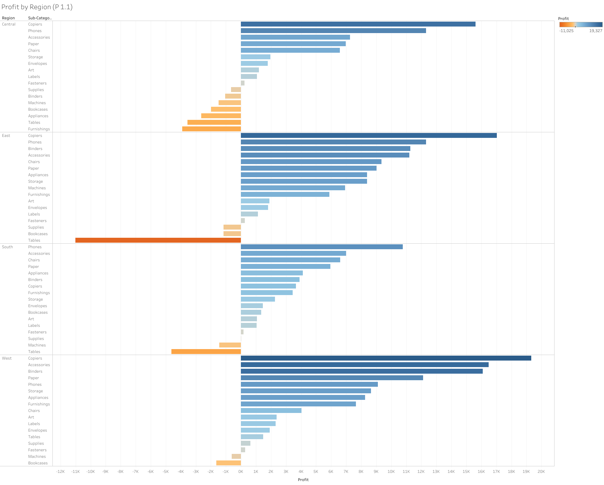
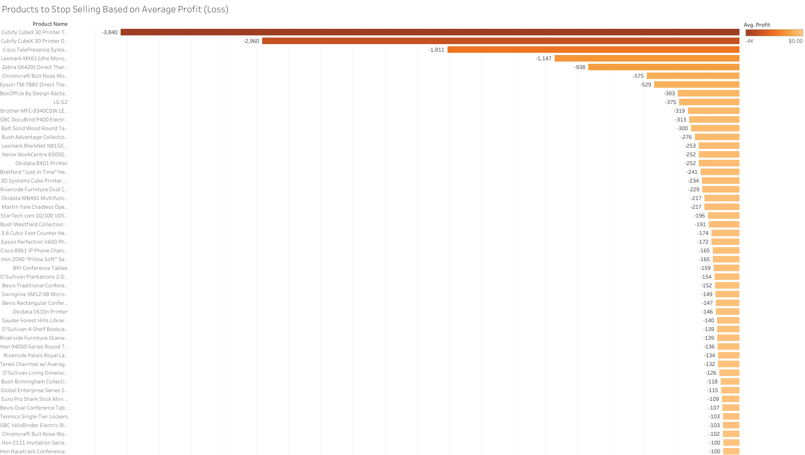
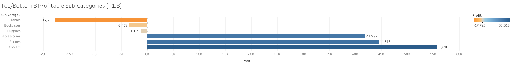
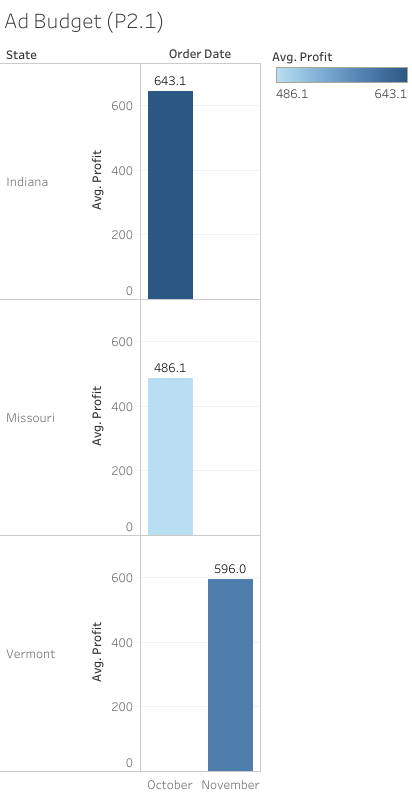
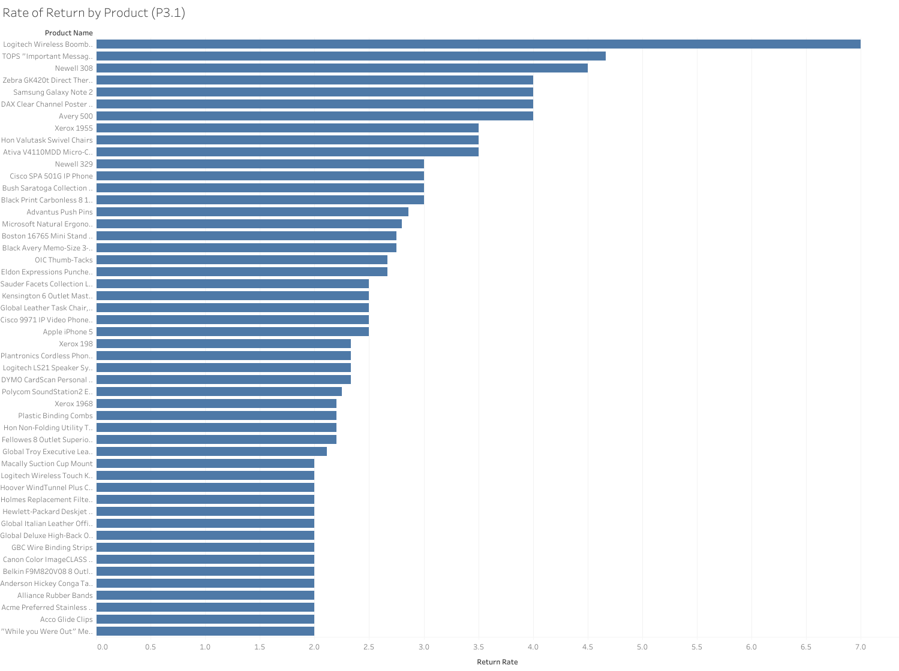
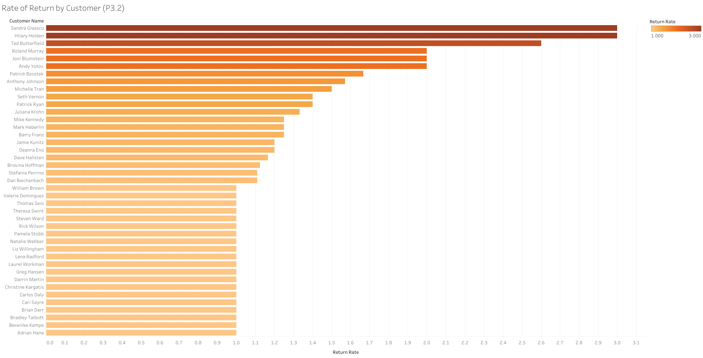
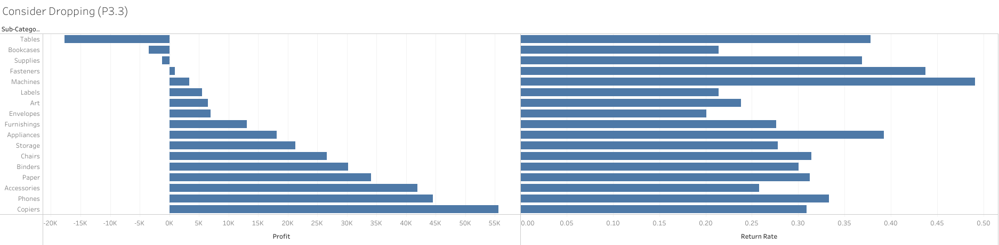

# 🏬 Superstore Profitability & Returns Analysis – Tableau

## 🚀 Overview  
This project uses Tableau to analyze operations of a fictional superstore at risk of bankruptcy. The goal was to identify opportunities to improve profitability by analyzing **high- and low-performing products**, **return patterns**, and **advertising opportunities** across time and geography.

---

## 📊 Key Focus Areas

### 🔹 Part 1: Profits & Losses  
- Identified top 2 profit centers and 2 major loss-makers by subcategory and region
  
  
  
- Highlighted **products with the greatest losses** and recommended which items the store should stop selling

  
  
- Selected **3 subcategories to focus on** and **3 to discontinue** based on profitability trends

  

### 🔹 Part 2: Advertising Strategy  
- Evaluated **average profit per unit sold by state and month**  
- Identified **3 optimal state/month combinations** for ad spend based on ROI logic

  
  
- Calculated how much the superstore could spend on advertising using a **1/5 total profit return-to-ad ratio**  

#### 📊 Advertising ROI Breakdown

| **State**   | **Month** | **Avg Profit ($)** | **Total Profit ($)** | **Ad Budget ($)** |
|-------------|-----------|--------------------|-----------------------|-------------------|
| Indiana     | October   | 643.10             | 9,004                 | 1,801             |
| Missouri    | October   | 486.10             | 972                   | 194               |
| Vermont     | November  | 596.00             | 1,192                 | 238               |

### 🔹 Part 3: Returned Items  
- Joined `Returns` table to `Orders` using a LEFT JOIN to capture all returned and non-returned items  
- Created a calculated field for `Return Rate` (`Yes` = 1, `Null` = 0)  
- Identified:
  - Products with the **highest return rates**

    
    
  - Customers most likely to return products

    
    
- Compared **profit vs. average return rate** across dimensions like state and shipping mode to assess operational efficiency

---

## 🖼️ Visualizations

- ✅ Profitability heatmaps by subcategory and region

  
   
- 📦 Top products to discontinue (high loss or high return rate)

  
  
- 📈 State/month combo charts for ad targeting

  
  
- 👥 Return rate by customer segment

  

> *(See visuals/ folder for preview screenshots)*

---

## 💡 Key Insights

- Certain product subcategories (e.g. Tables) consistently generated losses and had high return rates  
- Top-performing products were concentrated in Central Region + Copiers  
- Advertising is most effective in Indiana during month of October, yielding the highest **ROI potential**  
- Return patterns suggested operational issues linked to specific **shipping modes and product categories**

---

## 📂 Files Included

- 📄 `Superstore_Profitability_Analysis.twbx` – Tableau workbook (optional)  
- 📊 `visuals/` – Screenshots of dashboards and visualizations  
- 📃 `README.md` – Project overview and documentation  

---

## ✅ Conclusion  
This Tableau project combines business insight with strong data storytelling. From identifying products to discontinue, to mapping state-by-month advertising ROI, to uncovering patterns in returns — this dashboard equips executives with the information needed to make data-informed decisions to save the superstore.

